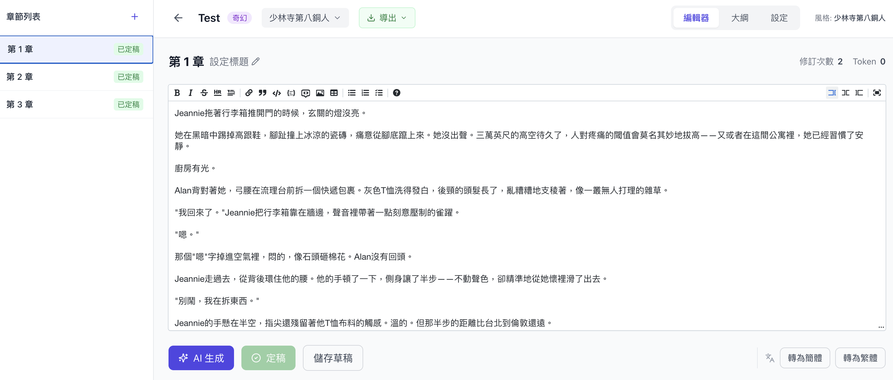
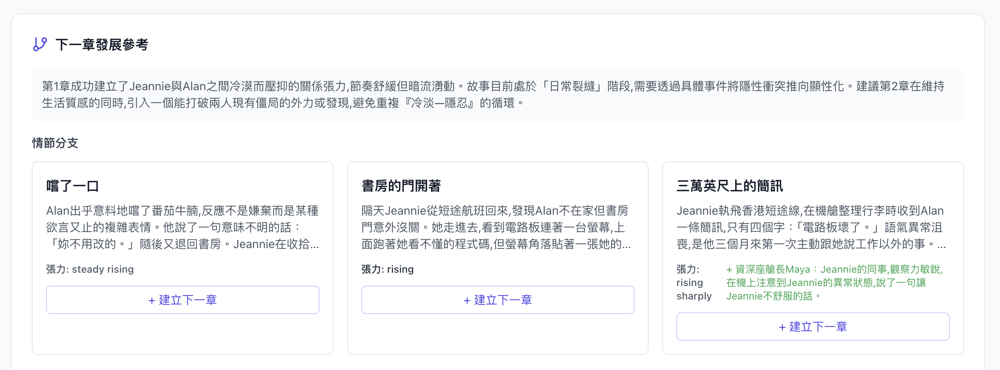

# AI 长篇小说创作平台

一个会「越写越像你」的 AI 小说写作平台：上传作品让 AI 学习作者风格，给情节方向生成章节草稿，经双重审核后人工定稿；定稿时自动抽取角色／世界观、规划下章分支，并从你的编辑差异中学习写作偏好，注入后续生成。

## 界面一览

**首页** — 多 Agent 协作、角色管理、风格定制三大能力入口


**章节编辑器** — 生成草稿、双审核、定稿，支持繁简转换与导出



**下章分支建议（The Foreseer）** — 2–3 条情节分支，含张力评估与新角色建议，一键建立下一章



## 核心能力

- **风格学习（The Profiler）**：上传 EPUB / TXT / PDF，提取风格特征面板与风格向量库
- **章节生成（The Weaver）**：结合风格特征、风格范例、剧情上下文与个人偏好写草稿
- **双重审核（The Chronicler / The Stylist）**：逻辑连贯性 + 风格匹配度审查，最多 2 轮自动修订
- **定稿管道（finalize pipeline）**：The Extractor 抽取角色／地点／世界规则／伏笔，The Foreseer 规划 2–3 条下章分支（含新角色建议），The Editor Analyst 从 draft→final 的 diff 学习偏好（1–5 星强度，会自动强化／淘汰规则）
- **混合检索**：pgvector 语意向量 + jieba 分词 BM25，RRF 融合后经 rerank 模型重排，双轨向量库（剧情库／风格库）各自独立

## 技术栈

| 层 | 技术 |
|---|---|
| 前端 | Next.js 14（App Router）+ TypeScript + Tailwind + Zustand |
| 后端 | Python 3.11 + FastAPI + SQLAlchemy 2.0 async + LangChain + ARQ worker |
| 资料库 | PostgreSQL 16 + pgvector（HNSW 索引）+ tsvector/GIN（BM25） |
| 快取／伫列 | Redis 7 |
| LLM | 任何 OpenAI-compatible 供应商（预设 DashScope：chat / embedding / rerank），支持 per-agent 独立设定 model、Base URL、API Key |

## 快速开始

```bash
git clone <repo-url> && cd story-weaver-platform
cp backend/.env.example backend/.env      # 填入 LLM_API_KEY 与 SECRET_KEY
cp frontend/.env.example frontend/.env.local
docker compose up -d --build
```

- 前端 http://localhost:3000，后端 API http://localhost:8001
- 注册帐号 → 到 Settings 设定各 Agent 的 LLM 参数 → 上传作品建立风格 → 建专案开始写作
- 首次启动会自动执行 `alembic upgrade head` 建立 schema

## 专案结构

```
backend/
app/
api/          # auth / projects / chapters / styles 路由
agents/       # 7 个 AI Agent（profiler, weaver, chronicler, stylist, extractor, foreseer, editor_analyst）
services/     # llm_service / embedding / vector_store / 文件解析 / workflow
models/       # SQLAlchemy：user, project, chapter, style_profile, plot_chunks, style_chunks
worker.py     # ARQ 长任务（生成、风格分析）背景执行
alembic/        # DB migrations
tests/          # API E2E 测试
frontend/
src/app/        # landing, login, register, dashboard, settings, styles, projects/[id]
src/lib/        # api.ts, store.ts
docs/             # 架构决策与踩坑纪录
```

## 开发

```bash
# 前端类型检查（本机或容器内）
cd frontend && npx tsc --noEmit

# 后端测试（需容器内环境，本机无 pytest）
docker compose exec backend pip install -q -r requirements-dev.txt
docker compose exec backend pytest -q
```

前端 dev 模式挂载 `./frontend/src` 热重载；后端改动需 `docker compose up -d --build backend`。

## 安全注意

- `docker-compose.yml` 内 PostgreSQL 使用开发用帐密（`postgres/postgres`），**仅适用本机开发**，对外部署请自行替换
- `.env` 内含 API Key，已被 `.gitignore` 排除，请勿提交

## License

[AGPL-3.0](LICENSE) — 欢迎使用、研究与二次开发；但任何修改版本（包括以网路服务形式提供）必须以同样条款开源原始码。
